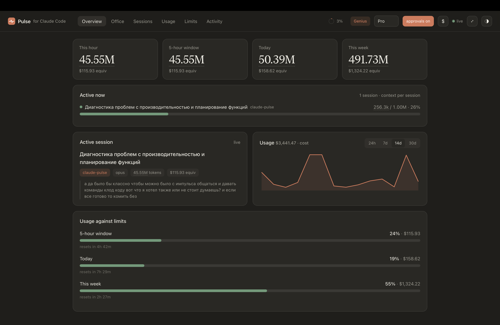
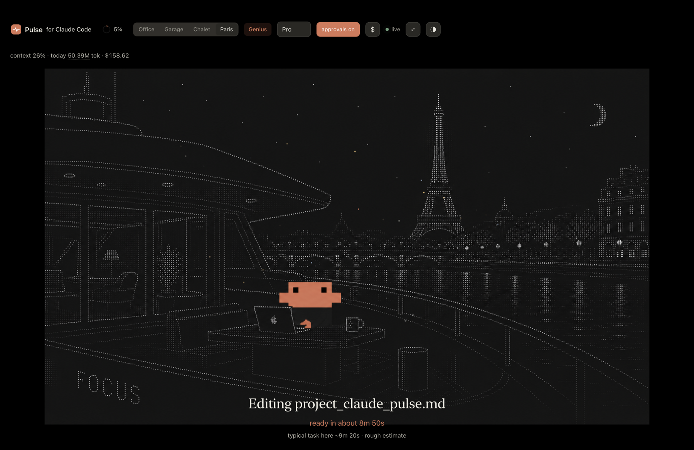
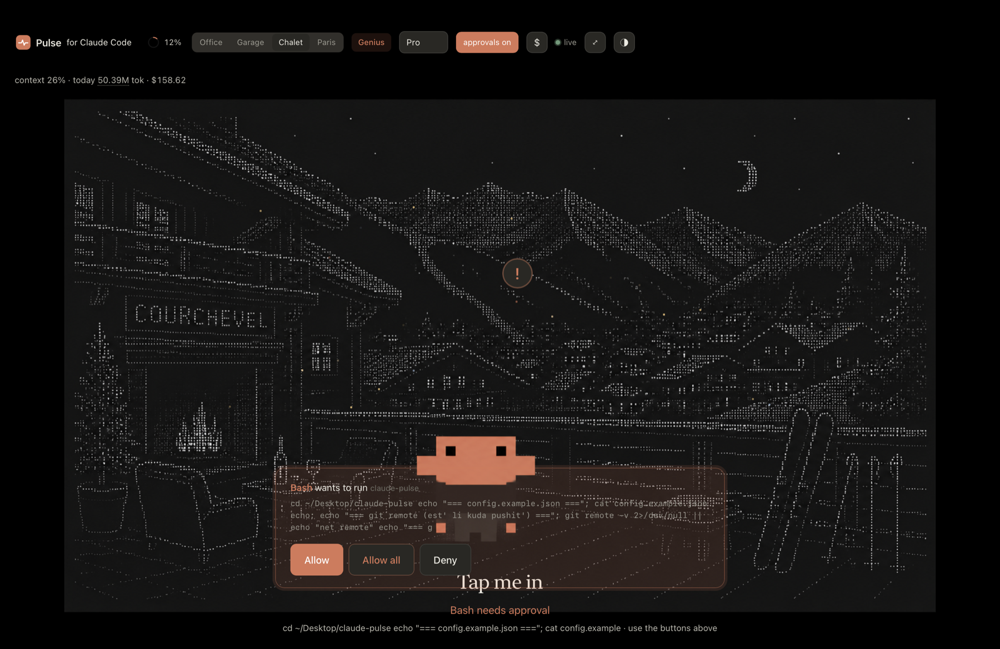

# Pulse for Claude Code

**A local dashboard for [Claude Code](https://claude.com/claude-code) that shows what Claude is doing, what it is spending, and lets you approve its tool calls from your phone.** Zero dependencies, nothing leaves your machine.



Claude Code already writes every session to disk. Pulse reads those files (read only) and turns them into a live dashboard: token spend by hour, day and week, the context fill of your active session, an ambient view of Claude at work, full-text search across everything you have ever run, and a notification with `Allow` / `Allow all` / `Deny` buttons when Claude needs you, on your desktop or your phone. No account, no telemetry, no network calls.

## Why you might want it

- **Approve from your phone.** A push with working `Allow` / `Allow all` / `Deny` buttons. No Wi-Fi setup, no IP, no open port: it works from anywhere, even on cellular.
- **Never lose a session.** One command recovers your last session as a readable transcript, and Pulse auto-snapshots active ones, so a crash or a frozen laptop never costs you context.
- **See the spend.** Live tokens and API-equivalent cost by hour, day, week, model and project, against budgets you set, with a phone alert when you cross one.
- **Ambient office.** A full-screen view of a little mascot working, resting, or waiting on you, with a rough ETA. Quietly addictive on a second monitor.
- **Search everything.** Full-text search across every session on disk, one click to the transcript.
- **Local and private.** Reads `~/.claude` read only, serves on `127.0.0.1`, zero dependencies, no telemetry.

| Ambient office view | Approve from the dashboard or your phone |
| --- | --- |
|  |  |

## Quick start

Requires Node 18+. Run it with no install:

```bash
npx pulse-for-claude-code
```

Or clone it:

```bash
git clone https://github.com/nikitadoudikov/claude-pulse.git
cd claude-pulse
node bin/cli.js
```

Either way it opens `http://127.0.0.1:4317`. To get desktop and phone
notifications and to approve tool calls, wire the hooks (one command, safe to
re-run):

```bash
claude-pulse install-hooks   # adds the hooks to ~/.claude/settings.json
```

Then restart Claude Code, and you are set. Other options:

```
claude-pulse --port 4317   # change the port
claude-pulse --no-open     # do not open the browser
```

## Keep it running

Run in the foreground and Pulse dies when you close that terminal. To keep it
alive independently, run it in the background:

```bash
claude-pulse start     # run detached, survives closing the terminal
claude-pulse status    # is it running?
claude-pulse stop      # stop it
claude-pulse restart   # stop and start again
```

If your terminal crashes, `claude-pulse start` brings it back in one command,
and a background instance is not affected by the crash in the first place.

On macOS you can hand Pulse to the system so it starts at login and respawns
itself if it ever dies:

```bash
claude-pulse install-service     # start at login, auto-restart
claude-pulse uninstall-service   # remove it
```

## Recover a lost session

Terminal crashed, laptop froze, hit a session limit? Nothing is lost: Claude
Code writes every session to disk as it happens. One command brings the last one
back, prints a recap and saves a readable transcript:

```bash
claude-pulse recover        # the most recent session
claude-pulse recover 2      # the one before that
claude-pulse recover <id>   # a specific session
```

It saves a light markdown file under `~/.claude-pulse/exports/` (a 15 MB log
becomes a ~180 KB file) and prints a link to read the full transcript in the
browser or on your phone. You can also open any session in the dashboard and use
**open transcript** / **download .md**.

While Pulse runs it also **auto-snapshots** every recently active session to
`~/.claude-pulse/exports/snapshots/` (one file per session, rewritten only when
it changes). So the latest state is always on disk even if you never run
`recover`. Set `snapshotMinutes` to `0` in `~/.claude-pulse.json` to turn it off.

To back up everything at once, `claude-pulse export-all` writes every session
into a single small gzipped markdown file, or use **download all history** on the
Sessions screen.

## Search every session

Lost where you did something? The **Sessions** screen has a search box that
scans every session on disk for a word or phrase and jumps you straight to the
transcript. It works from your phone too.

## On your phone

The simplest phone control is the ntfy notification itself: it carries working
`Allow` / `Allow all` / `Deny` buttons (see above), no network setup at all.

For a richer view, open `http://<your-machine>:4317/phone` on the same Wi-Fi
(needs `bindLan: true`) to see what Claude is doing right now plus a **Pause /
Resume** button. Pausing stops Claude from running further tools until you
resume. Both need the `PreToolUse` hook wired.

## How it works

```
  ┌──────────────┐   writes .jsonl    ┌──────────────────────┐   SSE    ┌──────────────┐
  │  Claude Code │ ─────────────────▶ │  Pulse  (read only)  │ ───────▶ │  dashboard   │
  │  (terminal)  │                    │   127.0.0.1:4317     │          │  + phone     │
  └──────┬───────┘                    └──────────────────────┘          └──────────────┘
         │
         │  hooks:  Notification  ·  Stop  ·  PreToolUse
         ▼
  ┌─────────────────────────────┐
  │  ~/.claude-pulse/           │   pending approvals · decisions · events
  └─────────────────────────────┘
```

Claude Code logs every session as JSONL under `~/.claude/projects/`. Each assistant
message carries a `usage` block (input, output and cache tokens) with a timestamp.
Pulse reads those files (read only), caches each file by modification time so
unchanged sessions are never re-parsed, and aggregates the numbers. The browser
gets live updates over Server-Sent Events. Three small hooks let Claude Code tell
Pulse when it needs you, when a turn ends, and when it wants to run a tool.

## Notifications when Claude needs you

Claude Code can run a hook when it needs your attention. Point its `Notification`
event at the bundled script and Pulse will show a banner and fire a desktop
notification, even if the tab is in the background.

The easy way is one command:

```bash
claude-pulse install-hooks     # wires the hooks into ~/.claude/settings.json (safe to re-run)
claude-pulse uninstall-hooks   # removes them
```

It backs up your settings once, merges next to any hooks you already have, and
never adds a duplicate. Restart Claude Code afterwards. To do it by hand instead,
add this to `~/.claude/settings.json` (use the absolute path to your clone):

```json
{
  "hooks": {
    "Notification": [
      {
        "matcher": "",
        "hooks": [
          { "type": "command", "command": "node /absolute/path/to/claude-pulse/hooks/notify-hook.js" }
        ]
      }
    ],
    "Stop": [
      {
        "matcher": "",
        "hooks": [
          { "type": "command", "command": "node /absolute/path/to/claude-pulse/hooks/stop-hook.js" }
        ]
      }
    ],
    "PreToolUse": [
      {
        "matcher": "",
        "hooks": [
          { "type": "command", "command": "node /absolute/path/to/claude-pulse/hooks/permission-hook.js" }
        ]
      }
    ]
  }
}
```

Keep `claude-pulse` running and you are set.

## Approve tools from the dashboard (and your phone)

With the `PreToolUse` hook wired, when Claude wants to run something that needs
permission, an approval card appears in Pulse with `Allow`, `Allow all` and
`Deny`. `Allow all` stops asking for the rest of the run.

This is built to never hang Claude. Read only tools pass straight through, and if
Pulse is not running, has not heard from you within the approval timeout (60s by
default, set `approvalTimeoutMs`), or hits any error, it falls back to the normal
terminal prompt. Nothing breaks if you ignore it. The phone push carries `Allow`,
`Allow all` and `Deny` buttons.

To approve from your phone, you only need an `ntfyTopic` (below) and the ntfy
app. The push notification carries `Allow`, `Allow all` and `Deny` buttons, and
tapping one sends the answer back through ntfy to a private reply topic that
Pulse listens on. No same Wi-Fi, no IP, no open port: it works from anywhere,
even on cellular. Pulse only acts on a reply while it is actually waiting for
that request, so a stale notification can do nothing.

```
  Claude wants to run a tool
          │
          ▼
   PreToolUse hook ──▶ Pulse ──push──▶ phone notification
          │                                   │
          │                              tap "Allow"
          │                                   │
          │                    answer returns over ntfy
          │                                   │
          ▼                                   ▼
   hook is still waiting ◀── decision ◀── Pulse (subscribed to the reply topic)
          │
          ▼
   hook returns "allow" ──▶ Claude runs the tool
```

## Phone push (optional)

To get a push on your phone when Claude needs you or finishes, pick a hard to
guess topic name, install the free [ntfy](https://ntfy.sh) app and subscribe to
that topic, then set it in `~/.claude-pulse.json`:

```json
{ "ntfyTopic": "claude-pulse-9f3a7c" }
```

With the hooks above wired, the `Notification` hook pushes when Claude is waiting
for you, and the `Stop` hook pushes when a turn finishes (debounced to 30s so a
back and forth does not spam you). Anyone who knows the topic can read it, so use
a random name.

If you set `budgets` (below), Pulse also pushes when a rolling window crosses 80%
then 100% of its budget, so you find out from your pocket, not by checking.

## Configuration

Copy `config.example.json` to `~/.claude-pulse.json` and edit. Every field is optional.

```json
{
  "plan": "max20",
  "contextLimit": 200000,
  "idleMinutes": 10,
  "approvalTimeoutMs": 60000,
  "budgets": { "fiveHour": 140, "day": 360, "week": 1100 }
}
```

### About limits

Anthropic does not publish exact subscription limits, and they are usage based
rather than a fixed token count. Pulse cannot read your real plan ceiling, so the
budgets above are rough API-equivalent estimates you adjust to match what you
observe. The `pro`, `max5` and `max20` presets are starting points, not official
numbers. Token cost is estimated from public API list prices purely as a usage
proxy; subscription users do not pay per token.

## Security and privacy

Pulse is local-first and opt-in. Out of the box it binds to `127.0.0.1` only,
makes no outbound calls, has zero dependencies (no supply chain), and reads
`~/.claude` read only. Nothing leaves your machine and there is no analytics. Two
optional features change that, and both are off until you turn them on:

- **Phone push (`ntfyTopic`)** routes through the public
  [ntfy.sh](https://ntfy.sh) relay. Approval prompts (with a short command
  summary) and your taps pass through a topic you name, so anyone who learns the
  topic can read those prompts and answer them. Use a long random topic, and
  self-host ntfy or use ntfy access tokens if you want stronger guarantees. Pulse
  only acts on a reply while it is genuinely waiting for that exact request, so a
  stale or guessed message cannot approve anything by itself.
- **LAN access (`bindLan`)** binds the server to your whole network so a phone on
  the same Wi-Fi can open the live `/phone` page. While it is on, other devices
  on that network can also read the dashboard and your transcripts, so only
  enable it on a network you trust. You do not need it for phone approvals (those
  go through ntfy), so most people should leave it off.

Runtime state, the device token and your config live in your home directory under
`~/.claude-pulse/`, and are never committed or sent anywhere.

## License

MIT
